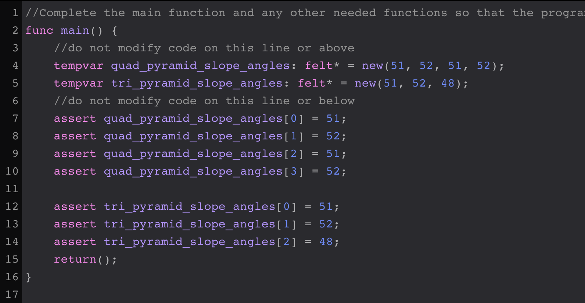
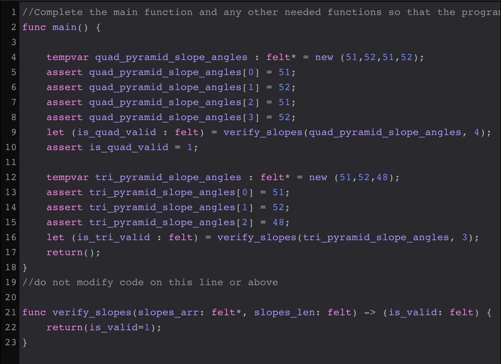
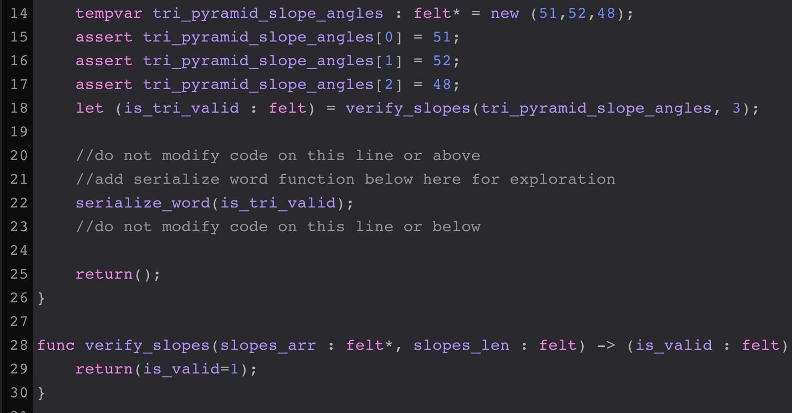
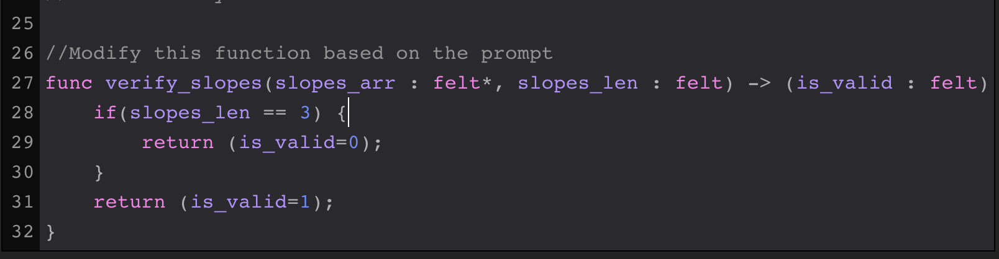
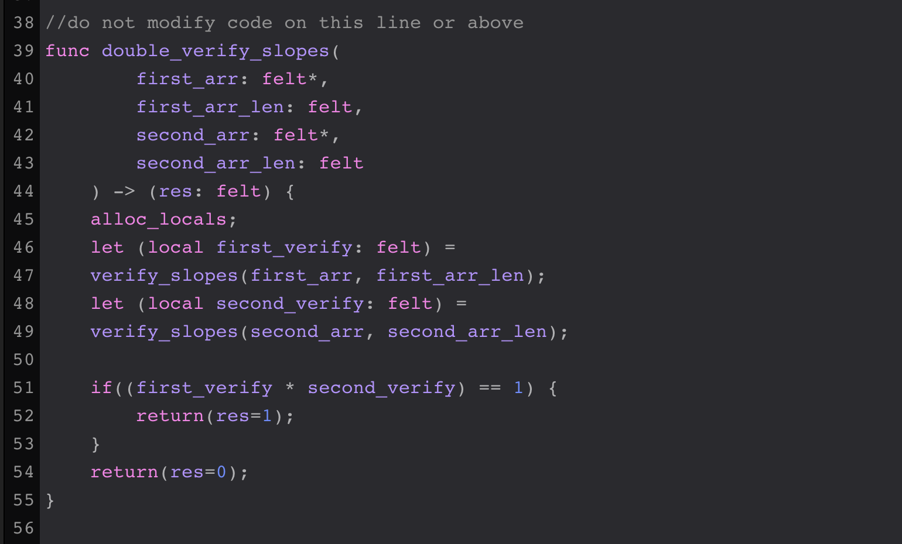

# Soluciones para los ejercicios de cairo mummies

Estas son unas posibles soluciones para las lecciones de [Cairo-Mummies](https://triality.org/education/course/cairomummies)

## Modulo 0

### Lección 0

La función main es el punto inicial para los programas de Cairo.  

**Sobre las funciones:**

* La palabra reservada `func` es usada para definir funciónes dentro.
* La logica de la funcion se escribe dentro de un bloque definido por `{}`.

  ```
    func main() {
      return();
    } 
  ```

* Cada función debe tener la instruccion de `return`

**Solución:**  


***

### Lección 1

`felt` es un tipo de dato primitivo en Cairo el cual es un entero de 252 bits.  
Existen diferentes formas de declarar una variable en cairo, pero en esta leccion se usa `let`.  
Los `assert` se usan para comparación de valores en Cairo.  

**Solución:**  


***

### Lección 2

Una función puede recibir parametros y retornar valores.  
Para esta lección crearemos una función con nombre `get_ideal_base_area` que recibira un parametro de tipo `felt` y retornara el resultado de multiplicar el parametro de entrada por 100.  

**Solución:**  


***

### Lección 3

Funciones Logicas y Condicionales.  

Una instruccion condicional comienza con la palabra `if` seguido de parentesis `()` y la comparacion dentro de los parentesis ej. `(1 > 9)`,  el resultado  de la evaluación regresa un `true` o un `false`, si el resultado es `true` entonces se ejecuta el codigo que esta dentro del cuerpo de la condición, si es `false` entonces se salta ese codigo  y no  se ejecuta.

**Solución:**  


# Modulo 0 Finalizado #


---

## Modulo 1

### Lección 0

Creando un Arreglo.  

Las Listas o Arreglos son necesarios en cualquier lenguaje de programación, en Cairo podemos pensar en los arreglos como espacios de memoria contiguos las cuales forman el tamaño del arrgelo y las direcciones de esos espacios de memoria contienen el valor guardado een la posicion del arreglo.  

Las variables temporales reservan un lugar en la memoria de forma temporal como lo indica su nombre, esto es que una vez ejecutada las instrucciones estas variables no estan disponibles para acceder desde otras funciones de nuestro programa de Cairo.

**Solución:**  


***  

### Lección 1  

Escribiendo funciones de firma recusrivas para Arreglos.   

La recursión es el acto de una funcion llamandose a si misma. En Cairo no conocemos la longitud de un array sin realizar un seguimiento de este en una variable separada, entonces el primer parametro es una referencia al elemento actual en el array y el segundo elemento representa cuantos elementos hay hasta que lleguemos al final del array.  

**Solución:**  


***  

### Lección 2  

Imprimiendo salidas.  

La función `serialize_word` ejecuta una salida en pantalla a los parametros que le enviemos, esta función es similar a `print` en python o `console.log` en JS.  

**Solución:**  


***  

### Lección 3  

Implementando Logica Recursiva.  

**Solución:**  


***  

### Lección 4

Variables Locales.  

A menudo usamos variables `let` o `tempvar` pero como regla geeneral no debemos usar este tipo de variables en escenarios complejos porque incrementa la probabilidad de que se revoque una variable y pierda su valor durante la ejecucion del programa.  
En  funciones simples y funciones que no llaman a otras funciones, `let` y `tempvar` normalmente funcionan bien, pero usamos variables locales (`local`) la mayor parte del tiempo.  

**Solución:**  


***  
