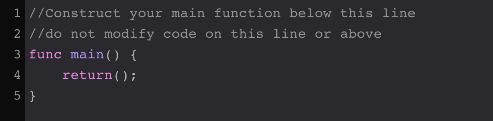
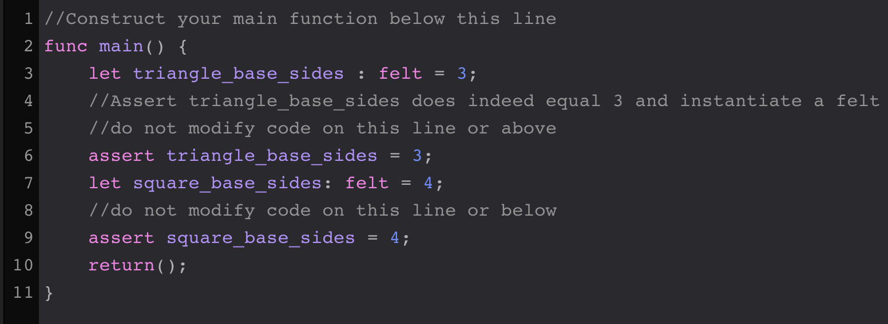
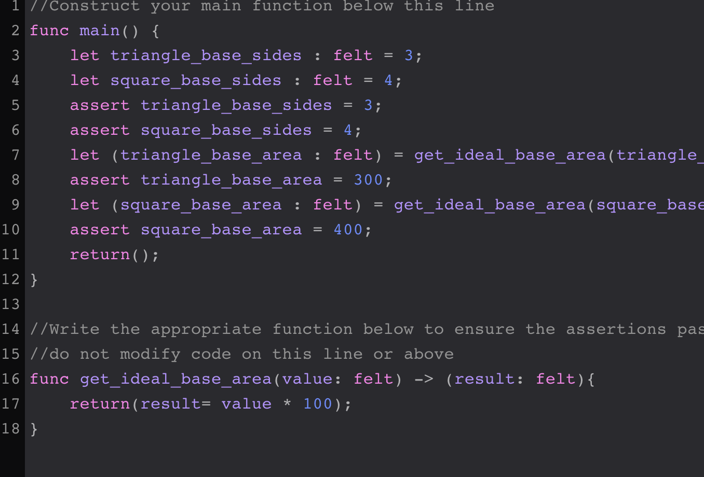
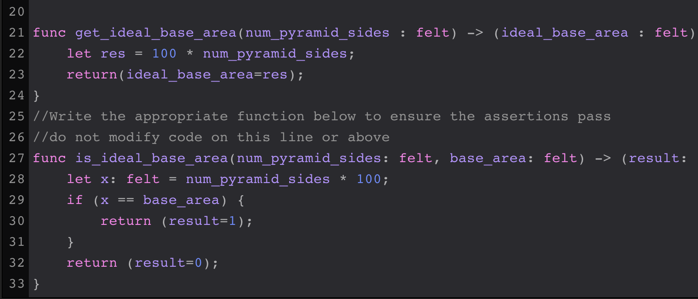

# Soluciones para los ejercicios de cairo mummies

Estas son unas posibles soluciones para las lecciones de [Cairo-Mummies](https://triality.org/education/course/cairomummies)

## Modulo 0

### Lección 0

La función main es el punto inicial para los programas de Cairo.  

**Sobre las funciones:**

* La palabra reservada `func` es usada para definir funciónes dentro.
* La logica de la funcion se escribe dentro de un bloque definido por `{}`.

  ```
    func main() {
      return();
    } 
  ```

* Cada función debe tener la instruccion de `return`

**Solución:**  


***

### Lección 1

`felt` es un tipo de dato primitivo en Cairo el cual es un entero de 252 bits.  
Existen diferentes formas de declarar una variable en cairo, pero en esta leccion se usa `let`.  
Los `assert` se usan para comparación de valores en Cairo.  

**Solución:**  


***

### Lección 2

Una función puede recibir parametros y retornar valores.  
Para esta lección crearemos una función con nombre `get_ideal_base_area` que recibira un parametro de tipo `felt` y retornara el resultado de multiplicar el parametro de entrada por 100.  

**Solución:**  


***

### Lección 3

Funciones Logicas y Condicionales.  

Una instruccion condicional comienza con la palabra `if` seguido de parentesis `()` y la comparacion dentro de los parentesis ej. `(1 > 9)`,  el resultado  de la evaluación regresa un `true` o un `false`, si el resultado es `true` entonces se ejecuta el codigo que esta dentro del cuerpo de la condición, si es `false` entonces se salta ese codigo  y no  se ejecuta.

**Solución:**  



# Modulo 0 Finalizado #


---
